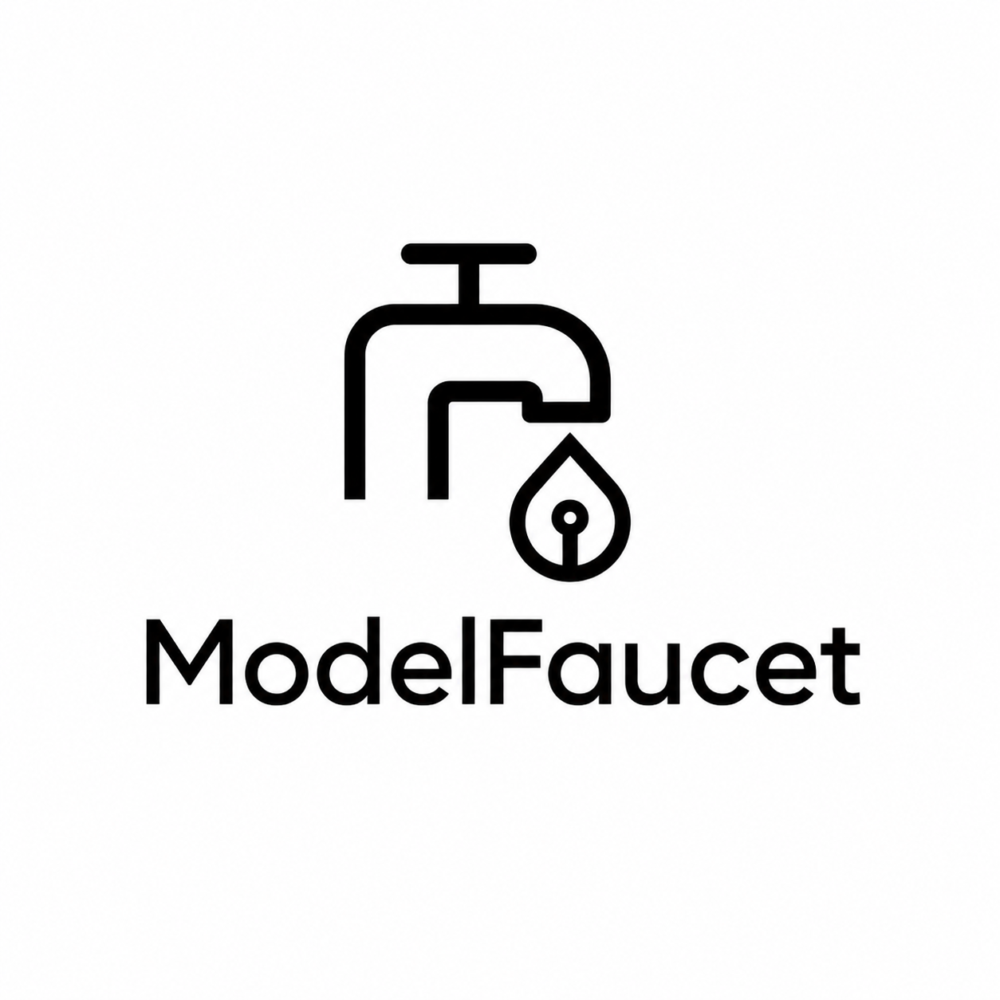

<p align="center">
  
</p>

<p align="center">
  <strong>English</strong> | <a href="README.zh-CN.md">简体中文</a>
</p>

# ModelFaucet

**Turn every app into an AI last-mile channel.**  
**Chinese name: 模型水龙头.**

ModelFaucet is an open-source LLM distribution gateway and embeddable SDK. It lets any website, app, plugin, desktop software, or vertical SaaS integrate AI features that feel native to the product, while automatically attributing token usage and revenue share to the software developer or distribution channel.

> Status: `0.8.0` source beta. The local stack includes the Control API, Gateway, Developer Console, SDK, React package, CRM demo, Local Bridge, wallet credits, Stripe test-mode top-ups, payout review, ledger reconciliation, CSV settlement reports, operations hooks, and security hardening checks.

---

## What ModelFaucet does

ModelFaucet combines six things that are usually implemented separately:

```txt
1. Embeddable AI SDK         Add AI features inside any app.
2. LLM Gateway              Route to cloud providers through one API.
3. BYOK                     Let end users bring their own API keys.
4. Local Bridge             Support Ollama, vLLM, LM Studio, and LAN models.
5. Usage Ledger             Record token usage, cost, price, and margin.
6. Revenue Sharing          Automatically credit channel/developer wallets.
```

The goal is not to build another generic chatbot. The goal is to make every software product a distribution channel for vertical AI capabilities.

---

## Core idea

```txt
Third-party App
  -> ModelFaucet SDK
  -> Session Broker
  -> Faucet Gateway
  -> Provider Router / LiteLLM / Local Bridge
  -> Usage Ledger
  -> Rating Engine
  -> Developer Revenue Wallet
```

End users can use AI in three ways:

```txt
Default faucet mode:    No API key needed. User buys credits or uses included quota.
BYOK mode:              User enters their own provider API keys.
Local mode:             User routes sensitive tasks to local or LAN models.
```

Developers can configure their app as a channel:

```txt
- Create app
- Get public_app_id
- Embed SDK
- Configure feature manifest
- Choose markup and revenue share
- Receive automatic revenue entries
```

---

## Why this exists

Most LLM infrastructure products solve model access. They do not fully solve distribution economics.

ModelFaucet adds the missing layer:

```txt
LLM Gateway
+ vertical app SDK
+ end-user friendly AI UX
+ BYOK and local models
+ usage-based billing
+ channel attribution
+ automatic payout ledger
```

This lets a CRM, helpdesk, ecommerce admin, CMS, spreadsheet tool, browser extension, or desktop app become an AI distribution endpoint without rebuilding billing, key management, routing, and token accounting from scratch.

---

## Architecture

```txt
+---------------------------------------+
| Third-party App / Website / Plugin    |
| @modelfaucet/sdk + UI Components      |
+-------------------+-------------------+
                    |
                    v
+---------------------------------------+
| Session Broker                        |
| app auth, user hash, feature policy   |
| ephemeral session token               |
+-------------------+-------------------+
                    |
                    v
+---------------------------------------+
| Faucet Gateway                        |
| OpenAI-compatible /v1                 |
| routing, fallback, budget, streaming  |
+-------+-------------------+-----------+
        |                   |
        v                   v
+---------------+     +----------------+
| LiteLLM Proxy |     | Local Bridge   |
| Cloud LLMs    |     | Ollama/vLLM    |
+-------+-------+     +-------+--------+
        |                     |
        v                     v
+---------------------------------------+
| Usage Meter + Rating Engine           |
| token count, cost, price, margin      |
+-------------------+-------------------+
                    |
                    v
+---------------------------------------+
| Ledger + Billing + Settlement         |
| wallets, revenue share, payout        |
+---------------------------------------+
```

---

## MVP modules

```txt
apps/
  api/                 Control plane API: apps, users, keys, wallets, usage.
  gateway/             OpenAI-compatible request proxy and route selector.
  dashboard/           Developer console and admin dashboard.

packages/
  sdk-js/              Browser/server TypeScript SDK.
  react/               Drop-in React components.
  shared/              Shared types, schemas, and utilities.

services/
  local-bridge/        Local/LAN model bridge for Ollama, vLLM, LM Studio.
  rating-worker/       Token usage pricing and margin calculation.
  settlement-worker/   Wallet entries, payouts, reconciliation.

infra/
  db/                  PostgreSQL schema and migrations.
  docker/              Local development compose files.

docs/
  WHITEPAPER.md        Human-readable project whitepaper.
  CONSTRUCTION.md      Codex-ready implementation guide.
  API_SPEC.md          Public and internal API specification.
  SECURITY.md          Security architecture and threat model.
```

---

## Quickstart

The local stack uses PostgreSQL, Redis, and LiteLLM through Docker Compose.

```bash
# 1. Start dependencies
cp .env.example .env
docker compose up -d postgres redis litellm

# 2. Install packages
pnpm install

# 3. Run migrations and seed data
pnpm db:migrate
pnpm db:seed

# 4. Optional: run the local end-to-end smoke test
pnpm smoke:local

# 5. Start API, gateway, and dashboard
pnpm dev

# 6. Run CRM demo in another shell
pnpm --filter crm-demo dev
```

For a zero-secret local smoke path, `pnpm smoke:local` starts a local
OpenAI-compatible mock provider and verifies session creation, gateway routing,
usage recording, ledger entries, and dashboard aggregates.

For platform cloud routing, put a real test provider key in `.env` before using
LiteLLM, for example `OPENAI_API_KEY=<your-test-key>`. Do not commit `.env`.
Without a provider key, use BYOK, the Local Bridge, or the mock provider smoke path
for end-to-end model calls.

Then in the demo app:

```ts
import { createFaucet } from "@modelfaucet/sdk";

const faucet = createFaucet({
  publicAppId: "app_pub_demo",
  user: { id: "demo-user-1" }
});

const result = await faucet.chat({
  feature: "customer_reply",
  input: {
    ticket_text: "客户说物流太慢，要求退款。"
  }
});
```

Expected behavior:

```txt
- SDK creates a short-lived session token.
- Gateway routes to the platform provider pool.
- The response streams back to the app.
- usage_events receives a row.
- ledger_entries records user debit, provider cost, developer revenue, platform revenue.
- Developer dashboard shows usage and revenue.
```

---

## Documentation site

The repository includes a VitePress docs site for GitHub Pages.

```bash
pnpm docs:dev
pnpm docs:build
pnpm docs:preview
```

The Pages workflow publishes the docs from `docs/.vitepress/dist` on pushes to `main`.

See the [local smoke test guide](docs/local-smoke.md) for Docker Compose and
non-Docker verification.

See the [provider routing guide](docs/provider-routing.md) for LiteLLM timeout,
retry, health-check, fallback, and real-provider smoke behavior.

See the [SDK and Local Bridge guide](docs/sdk-local-bridge.md) for `runFeature`,
React usage display, Local Bridge diagnostics, and offline local usage reporting.

See the [operations guide](docs/operations.md) for request IDs, readiness,
metrics, rate limits, migration rollback, backup, and restore.

See the [billing and settlement guide](docs/billing-settlement.md) for Stripe
webhook replay, ledger reconciliation, wallet adjustments, payout review, and
CSV exports.

See the [threat and abuse model](docs/threat-abuse-model.md) for the current
security invariants, SSRF controls, abuse cases, and release regression gates.

---

## API compatibility

ModelFaucet exposes OpenAI-compatible endpoints where possible:

```txt
POST /v1/chat/completions
POST /v1/responses
POST /v1/embeddings
```

It also exposes ModelFaucet-specific endpoints:

```txt
POST   /v1/sessions
GET    /ready
GET    /metrics
GET    /v1/user/wallet
POST   /v1/admin/wallets/:id/credit-test-balance
POST   /v1/user/provider-keys
GET    /v1/user/provider-keys
DELETE /v1/user/provider-keys/:id
GET    /v1/developer/apps
POST   /v1/developer/apps
PATCH  /v1/developer/apps/:publicAppId
DELETE /v1/developer/apps/:publicAppId
GET    /v1/developer/apps/:publicAppId/features
POST   /v1/developer/apps/:publicAppId/features
PATCH  /v1/developer/apps/:publicAppId/features/:featureKey
DELETE /v1/developer/apps/:publicAppId/features/:featureKey
GET    /v1/developer/operations
POST   /v1/developer/provider-keys
GET    /v1/developer/provider-keys
DELETE /v1/developer/provider-keys/:id
POST   /v1/user/stripe/checkout-sessions
POST   /v1/stripe/webhook
POST   /v1/admin/payouts/run-mock
POST   /v1/admin/payouts/:id/approve
POST   /v1/admin/payouts/:id/mark-paid
GET    /v1/admin/reconciliation/ledger
POST   /v1/admin/wallets/:id/adjustments
GET    /v1/admin/reports/usage.csv
GET    /v1/admin/reports/revenue.csv
GET    /v1/admin/reports/payouts.csv
GET    /v1/apps/:id/usage
```

---

## Security model

Never put real provider API keys in client-side code.

The SDK may contain:

```txt
- public_app_id
- public gateway URL
- feature manifest
- ephemeral session token
```

The SDK must never contain:

```txt
- OpenAI API key
- Anthropic API key
- Gemini API key
- OpenRouter API key
- Cloud provider secret
- developer or end user raw secret after storage
```

Real secrets belong in a server-side vault or KMS. Browser and mobile clients only receive short-lived virtual sessions.

Local/LAN endpoints must be called through the Local Bridge. The cloud gateway must not directly access user private network addresses.

---

## Revenue model

For platform faucet mode:

```txt
retail_price = upstream_cost × (1 + markup_percent)
gross_margin = retail_price - upstream_cost
developer_revenue = gross_margin × channel_share
platform_revenue = gross_margin - developer_revenue
```

For BYOK mode:

```txt
upstream_cost_to_modelfaucet = 0
revenue = explicit gateway fee / subscription fee only
```

For local mode:

```txt
upstream_cost_to_modelfaucet = 0
revenue = local bridge / enterprise management / support fee
```

---

## Feature manifest example

```yaml
app:
  name: Acme CRM AI
  vertical: crm

features:
  - key: customer_reply
    display_name: 客户回复生成
    input_schema:
      ticket_text: string
      customer_profile: object
    output_schema:
      reply: string
      risk_flags: array
    default_model_policy: cheapest_sufficient
    privacy_policy: redact_pii_before_cloud
    route_preference:
      - local
      - end_user_byok
      - developer_key
      - platform_pool
    pricing:
      mode: usage_markup
      markup_percent: 30
    revenue_share:
      channel_bps: 4000
      platform_bps: 6000
```

---

## Development roadmap

```txt
Phase 0 - Spec package
  README, whitepaper, construction docs, API spec, DB schema.

Phase 1 - Minimum revenue loop
  SDK -> session -> gateway -> LiteLLM -> usage -> ledger -> dashboard.

Phase 2 - BYOK
  End-user provider key storage, verification, routing, and usage reporting.

Phase 3 - Local Bridge
  Ollama/vLLM/LM Studio support, local health checks, usage reporting.

Phase 4 - Developer provider keys
  Developer key vault, routing priority, budgets, fallback.

Phase 5 - Payments and payouts
  Credits, wallet, Stripe test mode, payout workflow.

Phase 6 - Public open-source launch
  Docker Compose, docs site, example plugins, contribution guide.
```

---

## Docs

Start here:

```txt
docs/WHITEPAPER.md
  Product vision, business model, and system architecture.

docs/index.md
  Documentation site homepage.

docs/quickstart.md
  Documentation site quickstart.

docs/CONSTRUCTION.md
  Build plan, repo structure, milestones, tasks, acceptance criteria.

docs/API_SPEC.md
  API contracts for SDK, gateway, BYOK, local bridge, ledger.

docs/SECURITY.md
  Threat model, secret handling, local network protection.

docs/CODEX_TASKS.md
  Task list and prompts for Codex implementation.

docs/RELEASE_CHECKLIST.md
  Prerelease and hosted production verification checklist.
```

---

## License

Apache-2.0. See `LICENSE`.

---

## Project name note

A preliminary web search did not identify a major LLM infrastructure project with the exact name **ModelFaucet**. This is not a legal clearance. Before publishing packages, verify:

```txt
- GitHub organization availability
- npm package availability
- PyPI package availability
- Docker Hub / GHCR namespace
- Domain availability
- Trademark conflicts in target markets
```

---

## Repository bootstrap checklist

```txt
[x] Create GitHub repo: HiClawBot/modelfaucet
[x] Add LICENSE
[x] Add CODE_OF_CONDUCT.md
[x] Add CONTRIBUTING.md
[x] Add SECURITY.md
[x] Add docs site config
[x] Add pnpm workspace
[x] Add apps/api
[x] Add apps/gateway
[x] Add apps/dashboard
[x] Add packages/sdk-js
[x] Add packages/react
[x] Add infra/db migrations
[x] Add docker-compose.yml
[x] Add first CRM demo
```

---

## Maintainer stance

ModelFaucet should be built with three hard rules:

```txt
1. No real provider keys in clients.
2. No hidden fees in BYOK mode.
3. No cloud-side access to user private networks.
```
